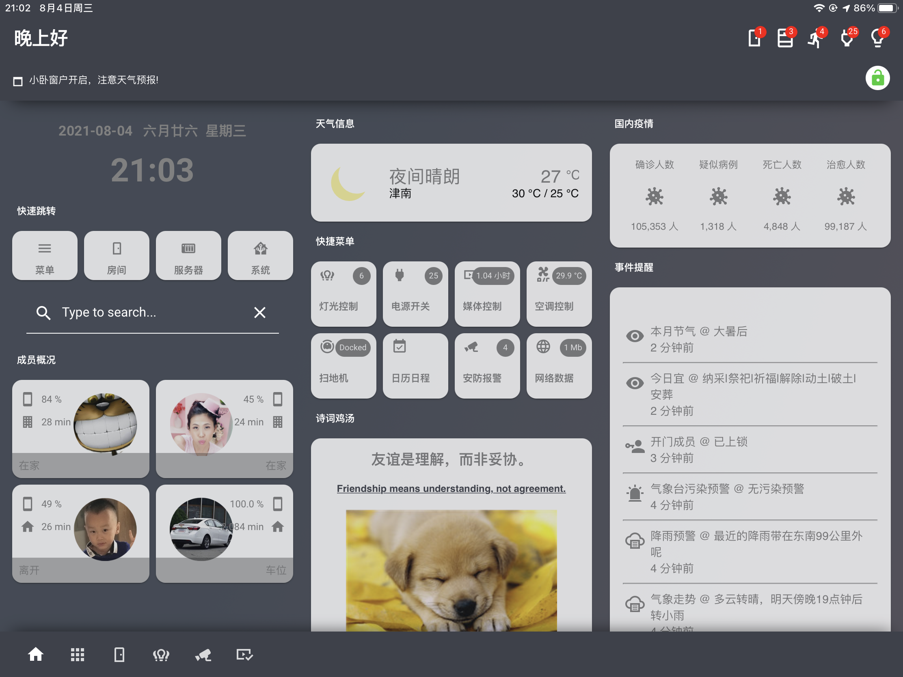
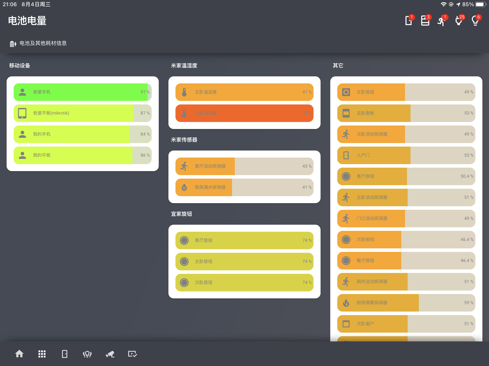
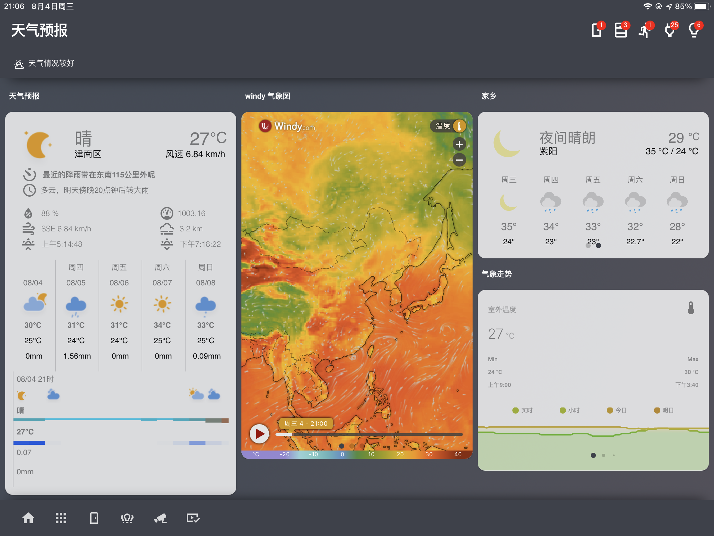
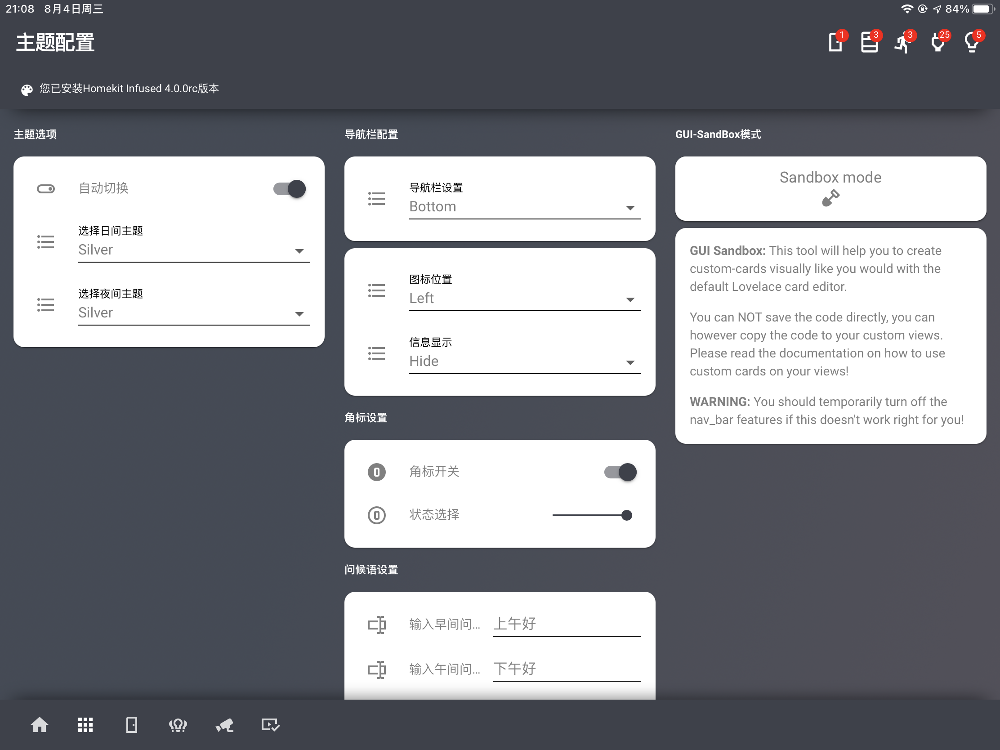

# 说明

本仓库主要分享我自己在玩HomeAssistant界面过程中,个人觉得好玩的界面框架及插件相关,顺便放上自己的示例配置,主要接触的主题框架有Homekit Infused和dwains-lovelace-dashboard,玩HKI比较多,DW相对较少,但是一直在关注,所以分享的配置主要以HKI4.0.0为主,目前最新版本是4.0RC.

PS:个人并不熟悉git相关操作,可能会闹不少笑话,不是互联网相关从业人员,请海涵,分享的东西对喜欢的人有参考性于我来说就是最大的满足了(当然也可能会挖不少坑,各取所需吧),感谢关注.

# 关于

## Homekit Infused

**Homekit Infused主题来自jimz011大神，相关链接：**

 - Github主页：https://github.com/jimz011/homekit-infused

 - 最新版本：https://github.com/jimz011/homekit-infused/releases

 - 安装&配置：https://jimz011.github.io/homekit-infused/installation.html

 - 插件说明: https://jimz011.github.io/homekit-infused/addons.html

## dwains-lovelace-dashboard

 - Github主页：https://github.com/dwainscheeren/dwains-lovelace-dashboard

 - 最新版本：https://github.com/dwainscheeren/dwains-lovelace-dashboard/releases

 - 配置Wiki: https://dwainscheeren.github.io/dwains-lovelace-dashboard/

 - 插件库：https://github.com/dwainscheeren/dwains-dashboard-addons

# 我的HKI 卡片

我会抽时间整理一下、将个人卡片效果配置放在这个仓库里面,感谢JIMZ011大佬,做了一个这么好玩的主题框架.

# 最后
感谢开源社区大神们,开源和分享是一种可贵的精神.

BTW:如果不知道怎么玩且感兴趣的小伙伴也欢迎关注我的B站,我会陆陆续续的更新一些相关的视频教程(如果我觉得有用且我自己满意的话 😂).

bilibili地址(暂时没更新,实在没时间,抱歉): https://space.bilibili.com/412408883 

--- 2021-08-06 by 土豆🥔.