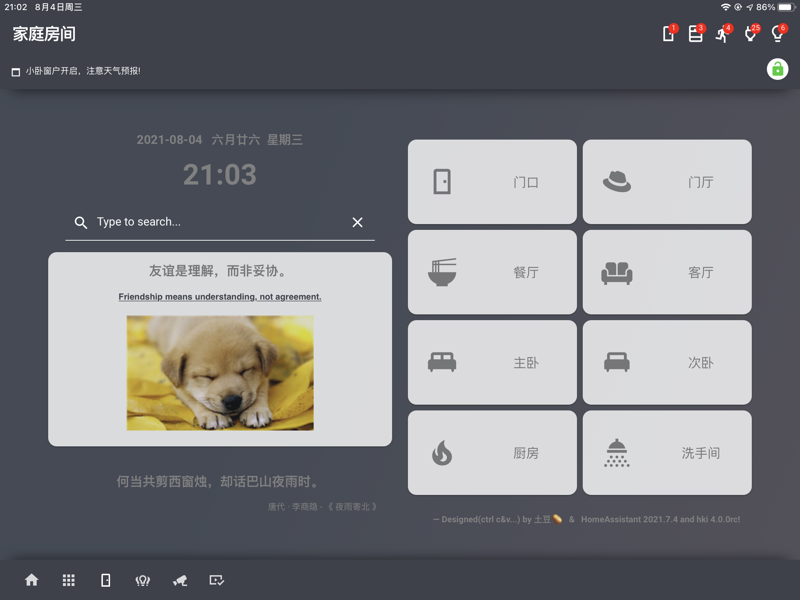
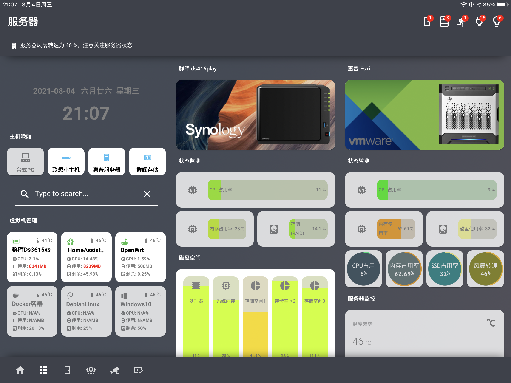
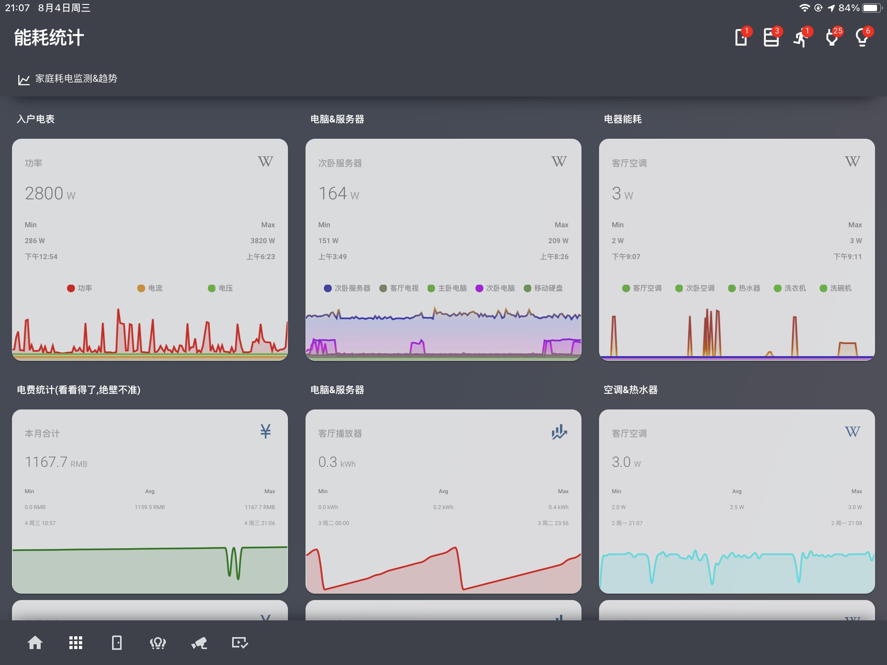

# 说明

本仓库主要分享我自己在玩HomeAssistant界面过程中、个人觉得好玩的界面框架及插件相关，顺便放上自己的示例配置。

主要接触的主题框架有Homekit Infused和dwains-lovelace-dashboard，玩HKI比较多，目前最新版本是4.0RC。

# 关于Homekit Infused

**Homekit Infused主题来自jimz011大神，相关链接：**

 - Github主页：https://github.com/jimz011/homekit-infused

 - 最新版本：https://github.com/jimz011/homekit-infused/releases

 - 安装&配置：https://jimz011.github.io/homekit-infused/installation.html

 - 插件说明: https://jimz011.github.io/homekit-infused/addons.html

   

# 我的卡片示例

#### 房间导航：

#### 媒体控制：

#### 状态监测：

#### 能耗统计：

...

我会抽时间整理一下，将个人卡片效果配置放在这个仓库里面,感谢JIMZ011大佬做了一个这么漂亮的主题框架，同时也感谢开源社区大神们带给我们这个好玩的HomeAssistant平台。

# BTW

如果不知道怎么玩且感兴趣的小伙伴也欢迎关注我的B站,我会陆陆续续的更新一些相关的视频教程 😂.

bilibili地址: https://space.bilibili.com/412408883 

--- update 2021-08-18 by 土豆🥔.
